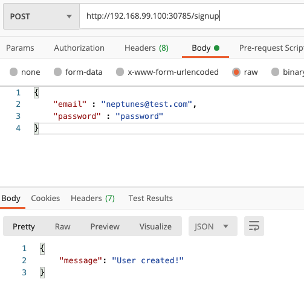
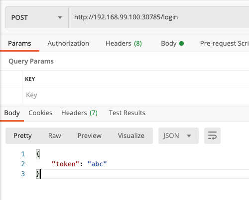

# kube-network-starter
study kube network


## 데모 프로젝트 구조

* Auth API
  * User API 서버와  같은 `pod` 에 위치한다.
* User API 
  * Auth API 서버와  같은 `pod` 에 위치한다.
  * Auth API 서버에 요청을 보낸다.
    * Pod-internal communication


## User API


### 코드 수정

* user API 서버를 먼저 실행하기위해 auth 서버와의 의존성을 제거한다.
* users-app.js파일 수정

```javascript
# 수정 전
const hashedPW = await axios.get('http://auth/hashed-password/' + password);
# 수정 후
const hashedPW = 'dummy text'

#수정 전
const response = await axios.get('http://auth/token/' + hashedPassword + '/' + password);
#수정 후
const response = {status: 200, data: {token: 'abc'}}
```


### 이미지 빌드

* users-api 디렉토리에서 진행

```bash
$ docker build -t neptunes032/kub-demo-user .
$ docker push neptunes032/kub-demo-user
```


### Deployment 리소스 생성

* Users-deployment.yaml 작성

```yaml
apiVersion: apps/v1
kind: Deployment
metadata:
  name: users-deployment
spec:
  replicas: 1
  selector:
    matchLabels:
      app: users
  template:
    metadata:
      labels:
        app: users
    spec:
      containers:
        - name: users
          image: neputunes032/kub-demo-user
```


### Service 리소스 생성

**Service**

* 변하지 않는 IP 주소
* pod를 클러스터 외부에서 접근할 수 있게 해준다.
* Users-service.yaml 작성하고 적용

**type**

* ClusterIP
  * 타입을 설정하지 않으면 기본적으로 ClusterIP 타입이 된다.
  * 클러스터 내부에서만 해당 IP로 접근할 수 있다.
* NodePort
  * 외부에서 접근이 가능하다.
  * 노드의 IP 주소를 사용한다.
    * 즉 IP 주소가 변경될 가능성이 있다.
* LoadBalncer
  * 노드와 독립적인 새로운 IP 주소를 사용한다.

```yaml
apiVersion: v1
kind: Service
metadata:
  name: users-service
spec:
  selector:
    app: users
  type: LoadBalancer
  ports:
    - protocol: TCP
      port: 8080
      targetPort: 8080
```

```bash
$ kubectl apply -f users-service.yaml
$ minikube service users-service
|-----------|---------------|-------------|-----------------------------|
| NAMESPACE |     NAME      | TARGET PORT |             URL             |
|-----------|---------------|-------------|-----------------------------|
| default   | users-service |        8080 | http://192.168.99.100:30785 |
|-----------|---------------|-------------|-----------------------------|
🎉  Opening service default/users-service in default browser...
```


### 작동 확인





## Auth API


### 코드 수정

1. users-app.js파일 수정

* 도커 컴포즈 환경과 쿠버네티스 환경에서 서비스끼리 커뮤니케이션을 하기위해 사용하는 도메인이 다르다
* 따라서 외부에서 환경변수를 받아 사용하도록 수정한다.

```javascript
# 수정 전
const hashedPW = 'dummy text'
# 수정 후
const hashedPW = await axios.get(`http://${process.env.AUTH_ADDRESS}/hashed-password/` + password);

#수정 전
const response = {status: 200, data: {token: 'abc'}}
#수정 후
const response = await axios.get(
  `http://${process.env.AUTH_ADDRESS}/token/` + hashedPassword + '/' + password
);
```

2. 도커 컴포즈 수정

* 도커 컴포즈로 만들어진 컨테이너는 같은 네트워크로 묶여 컨테이너 이름 또는 서비스 이름을 도메인으로 사용해 컨테이너 끼리 커뮤니케이션이 가능하다.
* 따라서 환경변수로 커뮤니케이션 하고자 하는 컨테이너의 이름(서비스 이름)을 적용했다.

```yaml
version: "3"
services:
  auth:
    build: ./auth-api
  users:
    build: ./users-api
    environment:
      AUTH_ADDRESS: auth
    ports:
      - "8080:8080"
  tasks:
    build: ./tasks-api
    ports:
      - "8000:8000"
    environment:
      TASKS_FOLDER: tasks

```


### 이미지 빌드

* users-api 디렉토리에서 진행
* 수정된 코드 반영 재빌드

```bash
$ docker build -t neptunes032/kub-demo-user .
$ docker push neptunes032/kub-demo-user
```

* auth-api 디렉토리에서 진행

```bash
$ docker build -t neptunes032/kub-demo-auth  .
$ docker push neptunes032/kub-demo-auth
```


### Deployment 리소스 수정

* users-deployment.yaml 수정하기
* 한 pod에서 실행되는 컨테이너 끼리 커뮤니케이션 할 때 `localhost` 를 도메인으로 사용한다.
  * 따라서 환경변수로 localhost를 적용했다.

```yaml
apiVersion: apps/v1
kind: Deployment
metadata:
  name: users-deployment
spec:
  replicas: 1
  selector:
    matchLabels:
      app: users
  template:
    metadata:
      labels:
        app: users
    spec:
      containers:
        - name: users
          image: neptunes032/kub-demo-user:latest
          env:
            - name: AUTH_ADDRESS
              value: localhost
        - name: auth
          image: neptunes032/kub-demo-auth:latest

```

```bash
kubectl apply -f users-deployment.yaml
```


### 작동 확인




* user API 서버와 auth API 서버간의 커뮤니케이션이 성공적으로 동작했다. 
* 즉, Pod-internal communication 을 위해 localhost를 사용하면 된다.


## 데모 프로젝트 구조 변경

* Auth API
  * 독립된 pod 에 위치
* User API 
  * 독립된 pod 에 위치
  * Auth API 서버에 요청을 보낸다.
    * Cluster-internal communication
* Tasks API
  * 독립된 pod 에 위치
  * Auth API 서버에 요청을 보낸다.
    * Cluster-internal communication